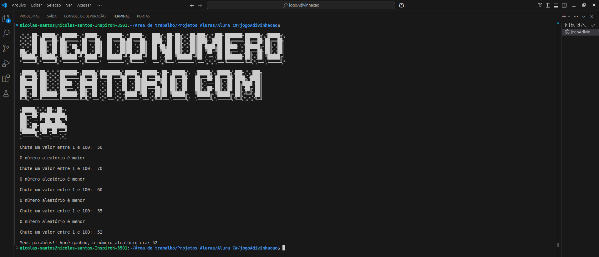

# Meu primeiro projeto com C# que desenvolvi durante o desafio no curso da Alura.

## O projeto é um jogo de adivinhação com números aleatórios

## Linguagem Utilizada:

* C#

## Desenvolvido por:
### Nicolas Santos

### Linkedin: https://www.linkedin.com/in/nicolas-santos-2a895a223/